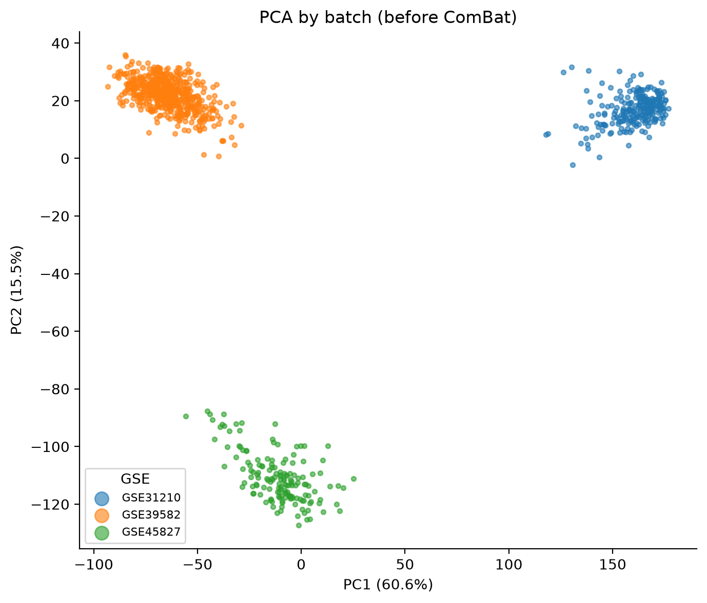
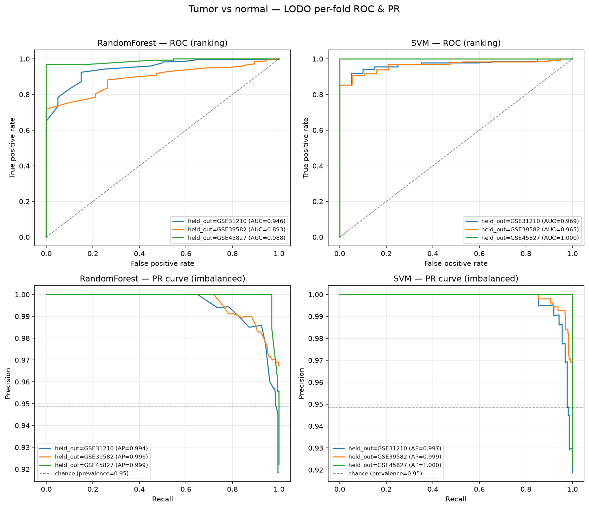
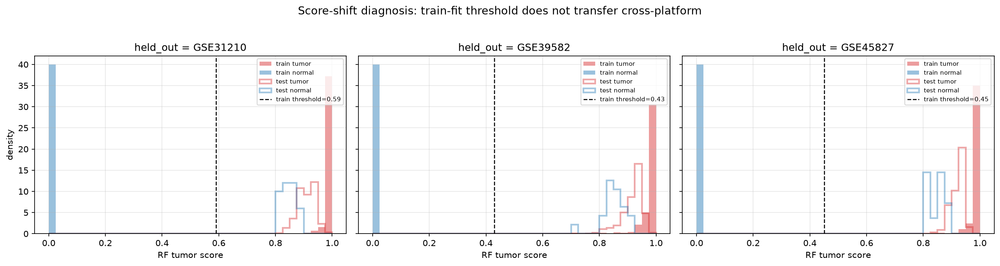
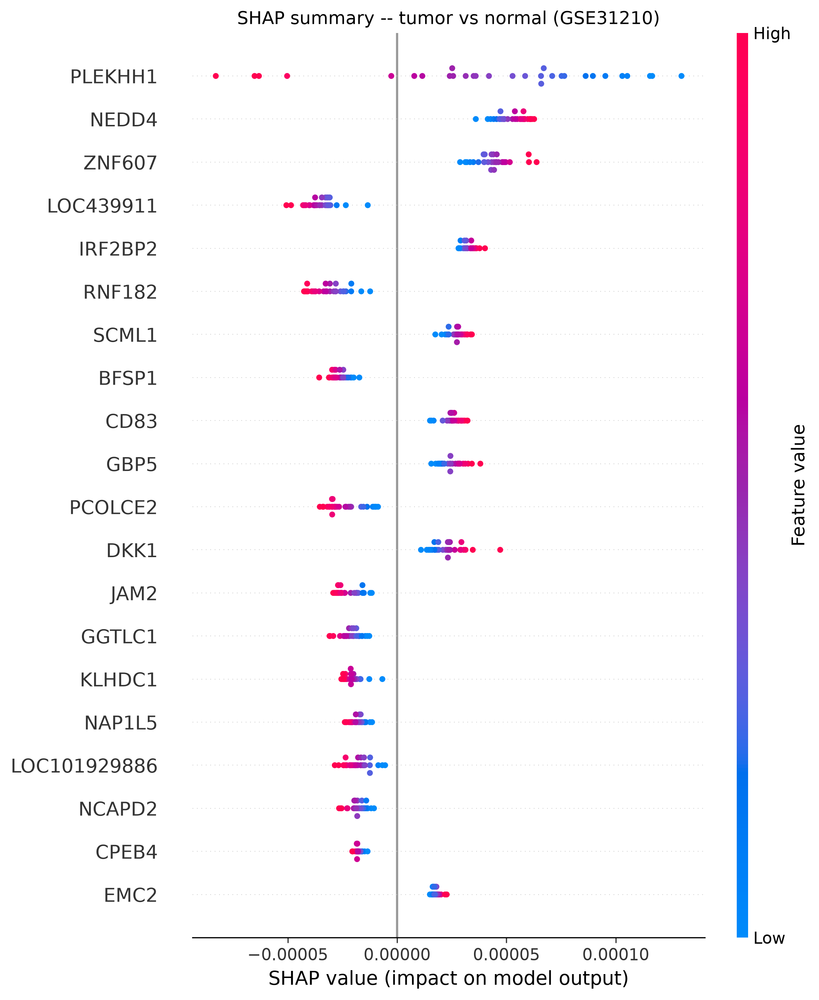
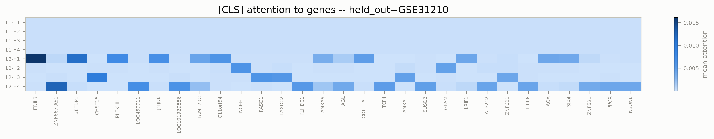
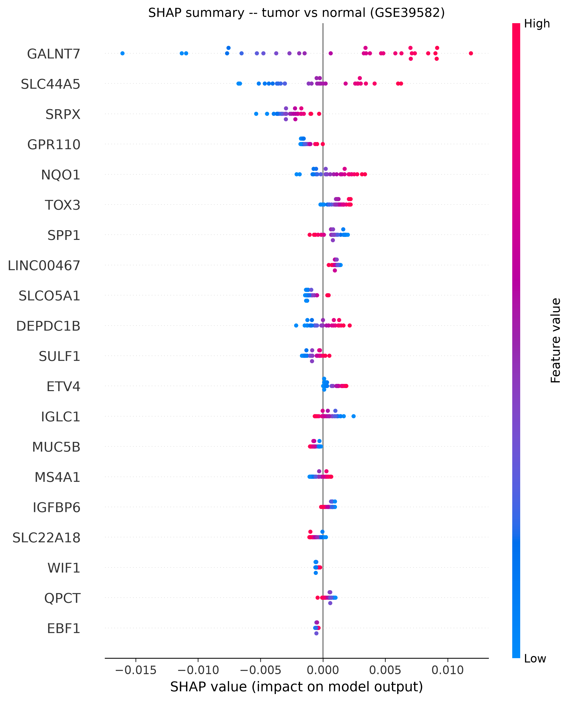
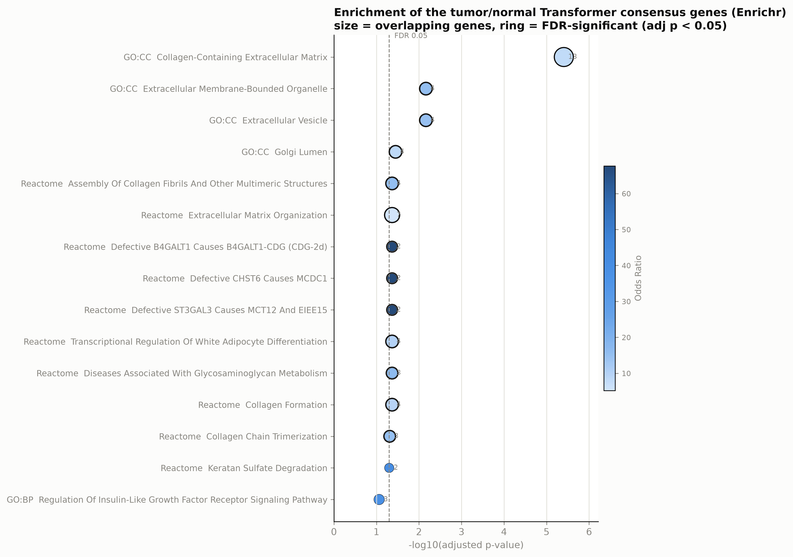

# Technical Report — From Batch Leakage to an Interpretable Tumor/Normal Classifier

**Project:** GeneTransformer · **Date:** 2026-09-13 · **Status:** complete

> 中文版 / 中文报告：[technical_report_zh.md](technical_report_zh.md)

---

## Abstract

We set out to predict **cancer type** from bulk gene expression with an interpretable
Transformer. A rigorous leave-one-dataset-out (LODO) evaluation revealed that the
naive 100 % accuracy was **batch leakage**: each public GEO series is a single cancer
type, so platform and class are perfectly confounded, and a random split lets any
model memorize the platform. Under LODO the multi-class task collapses to chance
(macro-F1 = 0.0), because an unseen cancer type is indistinguishable from an unseen
batch. Pivoting to the cross-platform **tumor-vs-normal** task — where the signal is
real and generalizes — the Transformer reaches **PR-AUC 0.9963 ± 0.0029 / ROC-AUC
0.9637 ± 0.0192**, on par with a strong RBF-SVM. SHAP and `[CLS]`-attention attribution
reveal a cross-fold consensus gene set dominated by **tumor-stroma / extracellular-matrix
remodeling** (collagens, *DCN*, *DPT*, *FBLN2*), with a metabolic component (*PFKFB3*,
*LPL*, *PDK4*). Pathway enrichment (Enrichr) confirms this is the **only** signal
surviving multiple-testing correction (GO:CC "Collagen-Containing Extracellular Matrix",
adj. p = 3.9 × 10⁻⁶). The report documents the confound, the pivot, the domain-shift
mechanism that defeats fixed thresholds, and the divergence between the Random-Forest
proliferation signature and the Transformer's stromal signature.

---

## 1. Introduction & Task

**Original task.** Classify cancer type (breast BRCA, lung LUAD, colorectal COAD) from
bulk microarray expression using a Transformer encoder, and explain each prediction.

**The generalization problem.** The public data available for these three types are
three *different* GEO platforms. Because each platform is also a single cancer type,
the class label is aliased with the batch. The central methodological question of the
project became: *does the model learn biology, or the batch?* We answer this with the
leave-one-dataset-out protocol (§3) and, after it exposed the confound, reframe the
task around the signal that genuinely transfers: tumor vs normal (§4).

---

## 2. Data

972 bulk **tumor/normal** samples across three independent Affymetrix platforms, after
intersecting to a common 14,725-gene matrix:

| Platform (GSE) | Tissue | # samples | # normal | # tumor |
|---|---|---|---|---|
| GSE31210 | Lung (LUAD) | 246 | 20 | 226 |
| GSE39582 | Colorectal (COAD) | 585 | 19 | 566 |
| GSE45827 | Breast (BRCA) | 141 | 11 | 130 |
| **Total** | | **972** | **50** | **922** |

Class imbalance is ≈ 18:1 (tumor:normal), so we use threshold-free metrics as primary
(§5) and up-weight the normal class where a model supports class weights.

**Preprocessing.** `log2(x + 1)` → per-gene z-score → **per-fold highly-variable-gene
(HVG) selection** (top-5000 by training variance) for the Transformer. Baselines are
fit on the same HVG features for a fair comparison.

---

## 3. Critical Finding: Batch Leakage

The multi-class task is fatally confounded. We verify it three independent ways:

1. **Batch identity is trivially predictable.** A classifier that predicts *which GSE
   platform* a sample came from scores **1.0** before batch correction and 0.980 after
   batch-only ComBat. Cancer identity is also predictable at 1.0 — because
   *batch == class*.
2. **Random-split control leaks.** With a random train/test split (the setup that
   produced the original "100 % accuracy"), RF and SVM both reach **macro-F1 = 1.0**.
3. **LODO collapses.** Holding out one entire platform (an unseen cancer type) drives
   both baselines to **macro-F1 = 0.0** — the model can only assign the held-out
   samples to a *seen* cancer type, and is always wrong.

**Conclusion.** The earlier 100 % accuracy was batch effect, not biology. `class ==
batch`, so ComBat with a cancer covariate is a singular (collinear) design and
batch-only ComBat removes the class signal along with the batch. Only LODO exposes
the confound, and it shows that *cross-platform multi-class cancer-type classification
is not identifiable from these three series.* This is the pivotal negative result that
shapes the rest of the project.

---

## 4. Pivot: Binary Tumor/Normal

Tumor vs normal is a different signal: it is present in *every* platform and does not
depend on which specific cancer type (and therefore which batch) a sample is. We
therefore reframe the task as **binary tumor/normal classification under LODO** — the
honest, hard generalization benchmark. All subsequent results are on this task.

---

## 5. Methods

### Models
- **Random Forest** and **RBF-SVM** — strong classical baselines on the HVG features.
- **GeneTransformer** — each gene has a learnable `d=128` embedding scaled by its
  expression value; a learnable `[CLS]` token is prepended; a 2-layer multi-head
  self-attention encoder (`n_heads=4`, `d_ff=256`, GELU, post-LN) aggregates context;
  the `[CLS]` output feeds an MLP head (`→ 64 → 2`).

### Evaluation
- **Primary metrics are threshold-free: PR-AUC and ROC-AUC.** Accuracy / F1 /
  balanced-accuracy are abandoned for this task: under ≈ 18:1 imbalance and domain
  shift they collapse to a misleading "predict-tumor-always" 0.5 even when the ranking
  signal is real.
- **Hard labels (secondary)** use **quantile alignment**: each held-out fold's score is
  thresholded at the *training* fold's normal-prevalence quantile — label-free on the
  test set, and the only threshold that survives the cross-platform score shift (§6).
- **LODO** holds out one whole platform per fold; every test fold is unseen in training.

---

## 6. Results — Binary Classification

| Model (LODO) | PR-AUC (mean ± std) | ROC-AUC (mean ± std) |
|---|---|---|
| Random Forest | 0.9961 ± 0.0025 | 0.9486 ± 0.0250 |
| SVM (RBF) | 0.9986 ± 0.0012 | 0.9776 ± 0.0154 |
| **Gene Transformer** | **0.9963 ± 0.0029** | **0.9637 ± 0.0192** |

The Transformer matches the SVM on PR-AUC and exceeds the RF on ROC-AUC, while remaining
end-to-end differentiable — the property that makes §7's attribution possible.

### Domain shift defeats fixed thresholds

The tumor/normal *ranking* transfers across platforms, but the *score scale* does not.
On the training fold the model saturates (tumor ≈ 1.0, normal ≈ 0.0); on the held-out
fold the normal scores shift up toward the tumor band (test normal median ≈ 0.85), so
any threshold learned on the training fold misclassifies most held-out normals.

Quantile alignment fixes this: normal recall rises from ≈ 0 under a fixed threshold to
0.54 (RF) / 0.59 (SVM). Crucially, `class_weight` (even 18:1) ≈ balanced does **not**
fix it — the shift is a score-scale offset induced by cross-platform technical variation,
not a class-prior problem.

---

## 7. Interpretability — SHAP & Attention

Two complementary, inference-only views of *why* the Transformer decides (no retraining;
run on CPU from local checkpoints):

- **SHAP (Deep SHAP / Gradient × Input).** For this architecture `shap.DeepExplainer`
  reduces to `SHAP[s,i] = (x[s,i] − mean(bg)[i]) · mean(d logit / d x_i)`, background =
  stratified train mean, target = `logit[tumor] − logit[normal]`. Computed in `batch=1`
  chunks because full self-attention over 5001 tokens is O(n²) and ~5 GB RAM would OOM.
- **Attention (`[CLS]` → gene).** The `[CLS]` token's self-attention row is recomputed
  per layer/head from the layer's Q/K projection weights (`_cls_attention`), materializing
  only the CLS row (O(L)) — exact to 1e-9 vs `need_weights=True` — averaged over layers,
  heads, and test samples.

**Cross-fold aggregation** is rank-based with an absent-fold penalty: each gene's per-fold
importance becomes a rank (1 = best); a gene absent from a fold's HVG set gets the worst
rank (`n_genes+1`); the two methods' mean ranks are summed. This rewards genes that are
*consistently* important across platforms and is robust to the heavy-tailed raw scores.

### Consensus genes (top-20, rank-based, `n_folds=3`)

> **ZNF521, PFKFB3, COL4A5, LPL, AFAP1-AS1, CDO1, DPT, LCN2, COL11A1, ABCA8,
> ACADSB, CLTC, C2CD4A, EBF1, FLJ13744, LEPR, AR, EGR3, CA4, DCN**

These cluster into **extracellular-matrix / stroma remodeling** (*COL11A1, COL4A5,
COL10A1, DCN, DPT, FBLN2, EFEMP1, CCDC80, ABI3BP, OGN, CLEC3B, EDIL3*) and
**metabolism / signaling** (*PFKFB3* glycolysis, *CDO1* methylation marker, *LCN2*,
*LPL, PDK4, ACADSB, GPAM*). Per-fold top genes are markedly platform-specific
(GSE31210 → PLEKHH1/NEDD4; GSE39582 → GALNT7/SLC44A5; GSE45827 → CST1/GPR110/SCARA5),
mirroring the domain shift — the consensus is what survives all three platforms.

---

## 8. Pathway Enrichment (GO / KEGG / Reactome)

Top-100 consensus genes → Enrichr (`KEGG_2021_Human`, `GO_BP/MF/CC_2023`, `Reactome_2022`).

**The one FDR-significant signal is extracellular-matrix / collagen organization:**

| Library | Term | adj. p | overlap |
|---|---|---|---|
| GO:CC | Collagen-Containing Extracellular Matrix | 3.9 × 10⁻⁶ | 13 |
| GO:CC | Extracellular Vesicle / Membrane-Bounded Organelle | 0.0069 | 4 |
| Reactome | Assembly of Collagen Fibrils & Other Multimeric Structures | 0.043 | 4 |
| Reactome | Extracellular Matrix Organization | 0.043 | 7 |
| Reactome | Collagen Formation / Chain Trimerization | 0.043–0.049 | 3–4 |

KEGG, GO Biological Process, and GO Molecular Function produce **no** term surviving
multiple-testing correction — their strongest nominal hits (GO:BP "ECM Organization"
raw p = 2.6 × 10⁻⁴, adj. p = 0.088; KEGG "AMPK signaling" raw p = 0.022, adj. p = 0.48;
KEGG "Pathways in cancer" adj. p = 0.48) are trending only. We report this **honestly**:
the consensus gene set is a **tumor-stroma / ECM-remodeling signature** with a secondary
metabolic component — not a classical oncogene/tumor-suppressor pathway.

---

## 9. Discussion

1. **The Transformer sees the tumor microenvironment.** Its most consistent genes are
   stromal/ECM — collagens, decorin, dermatopontin, fibulins — a hallmark of tumor
   desmoplasia, rather than a proliferation program.
2. **Low overlap with the RF proliferation signature.** The RF's top genes are
   proliferation markers (*TPX2, ECT2, UBE2C, UBE2T, PPAT, BOP1*); in the Transformer
   they rank only ~1000–3000 (SHAP) / ~400–900 (attention), and several are absent from
   multiple folds (`n_folds < 3`). This is expected: **(a)** HVG selects genes by
   *variance*, and low-variance proliferation genes are frequently dropped from the
   5000-gene Transformer input while the RF sees all ~15 k genes; **(b)** the two models
   have different inductive biases. The Transformer's HVG input predisposes it to
   high-variance stromal signals.
3. **Domain shift, not class prior, governs hard labels.** Under LODO the score scale
   shifts between platforms; only quantile alignment yields usable hard labels. This is a
   property of the data/feature-selection, not of the architecture.
4. **The pivotal result is the negative one.** Cross-platform multi-class cancer-type
   classification is not identifiable from these series (`batch == class`); the binary
   tumor/normal signal is. Any future work should source data where batch ≠ class (e.g.
   TCGA — one platform, multi-cancer + matched normal) before revisiting multi-class.

### Limitations
- Interpretability runs on 30 stratified test samples per fold (memory-bounded), so
  per-fold rankings are indicative, not exhaustive.
- Enrichment foreground is the top-100 consensus by *rank*, not a differential-expression
  test; background is Enrichr's default (all human genes). LncRNA/loci (AFAP1-AS1,
  FLJ13744, LOC285628, …) do not map to pathways and are silently excluded.
- The Transformer's AUC trails the SVM slightly; we did not tune it aggressively, since
  the project's goal was interpretability, not beating the SVM.

### Reproducibility
All hyperparameters and paths live in `config.yaml`; the seed is fixed (42).
Commands: `python -m src.baseline`, `python -m src.train`, `python -m src.explain_tn`,
`python -m src.enrichment`. Checkpoints, preprocessed matrices, and raw data are
gitignored (reproduced, not committed).
